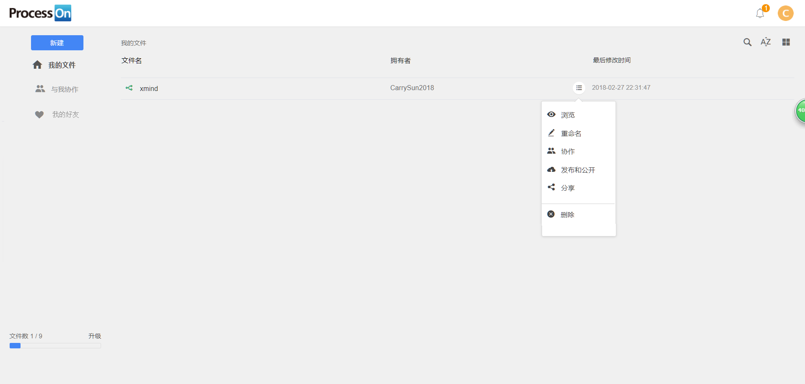

# 整体架构

## 描述:

思维导图又叫心智导图，是表达发散性思维的有效图形思维工具 ，它简单却又很有效，是一种革命性的思维工具。思维导图运用图文并重的技巧，把各级主题的关系用相互隶属与相关的层级图表现出来，把主题关键词与图像、颜色等建立记忆链接。思维导图充分运用左右脑的机能，利用记忆、阅读、思维的规律，协助人们在科学与艺术、逻辑与想象之间平衡发展，从而开启人类大脑的无限潜能。思维导图因此具有人类思维的强大功能。

## 要求：

* 1. 支持图文编辑、思维导图以及文本代码格式化
* 2. 客户端采用浏览器方式，支持跨平台操作
* 3. 可以实现作品的分享、协同编辑等功能

##  技术栈：

react + react-router + redux + webpack + koa2 + scss + es6

## 需求分析：

### 我的

    登录 注册 退出登录
    账户中心：用户名 邮箱 手机号 密码

### 我的文件

    列表、浏览、重命名、协作、分享、删除

</img>

### 与我协作

    列表、浏览、退出协作

</img>

### 我的好友
